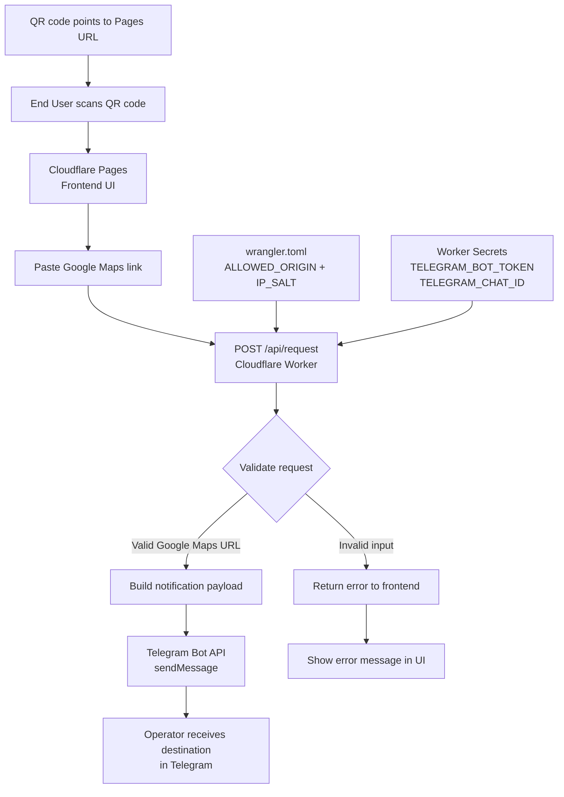

**Privacy-First Destination Relay**



A minimal, privacy-focused destination sharing tool that lets a End User scan a QR code, paste a Google Maps destination link, and send it privately to the operator without exchanging phone numbers, names, or WhatsApp details.

This project uses a static **Cloudflare Pages** frontend, a **Cloudflare Worker** API, and a **Telegram bot** as the private delivery channel. Cloudflare Pages is designed for static sites, and Cloudflare Workers provides serverless request handling at the edge.[web:386][web:396] Telegram Bot API supports simple message delivery through `sendMessage`.

## Why this exists

Many users are uncomfortable sharing personal contact details just to communicate a destination, and many are suspicious of QR flows because scam patterns are common. This project is designed around **data minimization**: only a Google Maps link is shared, while common personal identifiers are intentionally excluded.

## What it does

- Opens a simple QR-linked webpage.
- Accepts only a Google Maps destination link.
- Sends that link to the operator through a private Telegram notification.
- Avoids collecting name, phone number, WhatsApp number, contacts, OTP, payment details, or photos.

## What it does not collect

- Name
- Phone number
- WhatsApp number
- Contacts
- OTP
- Payment details
- Photos
- Device permissions

## Workflow

```text
End User scans QR
        ↓
Cloudflare Pages frontend
        ↓
Cloudflare Worker API (/api/request)
        ↓
Telegram Bot API
        ↓
Operator receives destination privately
```

### Components

| Component | Purpose |
|---|---|
| `pages/index.html` | Public-facing destination sharing page |
| `worker/worker-index.js` | Validates the request and forwards it to Telegram |
| `worker/wrangler.toml` | Worker configuration and non-secret environment values |
| Telegram bot | Private notification destination |

## Project structure

```text
privacy-destination-relay/
├── README.md
├── pages/
│   └── index.html
└── worker/
    ├── worker-index.js
    └── wrangler.toml
```

## How it works

1. A QR code points to the Cloudflare Pages URL.
2. The end user opens the page and pastes a Google Maps link.
3. The frontend sends the link to the Worker endpoint.
4. The Worker validates the request and calls Telegram Bot API.
5. The operator receives the destination in Telegram.

## Setup

### 1. Prerequisites

- Cloudflare account
- Node.js and npm
- Wrangler CLI
- Telegram account
- Telegram bot token
- Telegram chat ID

### 2. Install Wrangler

```bash
npm install -g wrangler
wrangler login
```

### 3. Add secrets

Inside the `worker/` directory:

```bash
wrangler secret put TELEGRAM_BOT_TOKEN
wrangler secret put TELEGRAM_CHAT_ID
```

### 4. Configure origin

Update `worker/wrangler.toml` with your Pages URL:

```toml
[vars]
ALLOWED_ORIGIN = "https://your-project.pages.dev"
IP_SALT = "replace-with-a-random-string"
```

### 5. Deploy the Worker

```bash
cd worker
wrangler deploy
```

### 6. Point the frontend to the Worker

In `pages/index.html`, replace the form action with your real Worker URL:

```html
<form id="ride-form" method="post" action="https://your-worker.your-subdomain.workers.dev/api/request?riderId=me" novalidate>
```

### 7. Deploy the frontend

Deploy the `pages/` folder to Cloudflare Pages using Direct Upload or a Git-connected project.

## Testing

Test the Worker directly with `curl`:

```bash
curl -X POST "https://your-worker.your-subdomain.workers.dev/api/request?riderId=me" \
  -H "Content-Type: application/json" \
  -d '{"mapsLink":"https://maps.app.goo.gl/test123"}'
```

Expected response:

```json
{"ok":true}
```

If configured correctly, a Telegram message should arrive in your bot chat.

## QR code

The QR code should point to the **Pages URL**, not the Worker URL.

Example:

```text
https://your-project.pages.dev
```

This allows the End User to land on the UI first, see what is being shared, and submit the destination from a transparent page.

## Privacy principles

This project is built around a small set of privacy-first ideas:

- Collect the minimum information needed.
- Explain clearly what is shared.
- Avoid direct phone-number exchange.
- Keep the frontend simple and easy to inspect.
- Use a relay model instead of personal chat as the default workflow.

## Limitations

- This is a one-way destination relay, not a full chat product.
- It does not provide strong anonymity against all infrastructure-level metadata.(Achivable with simple URL tweak if custom domain is used instead of Free Cloudflare domain)
- It currently has only basic validation.
- It relies on Telegram for delivery, so Telegram availability is part of the workflow.
- Daily the usage 

## Maintainer notes
- zero-cost friendly deployment
- privacy-first data collection
- QR-first entry flow
- Cloudflare Pages + Worker architecture
- Telegram as the default notification channel

## Scope of dockerization and alternative usage
- It can easily be dockerized if a custom domain is used and Cloudflare Workers are kept out of the Architecture in consideration of containerization. And can scaled for Fleet where each Operator Telegram needs to be onboarded so as to complete the cycle.
- Instead of Telegram, WhatsApp can also be used and it comes with Business Account API usage cost.

## License
GPL
